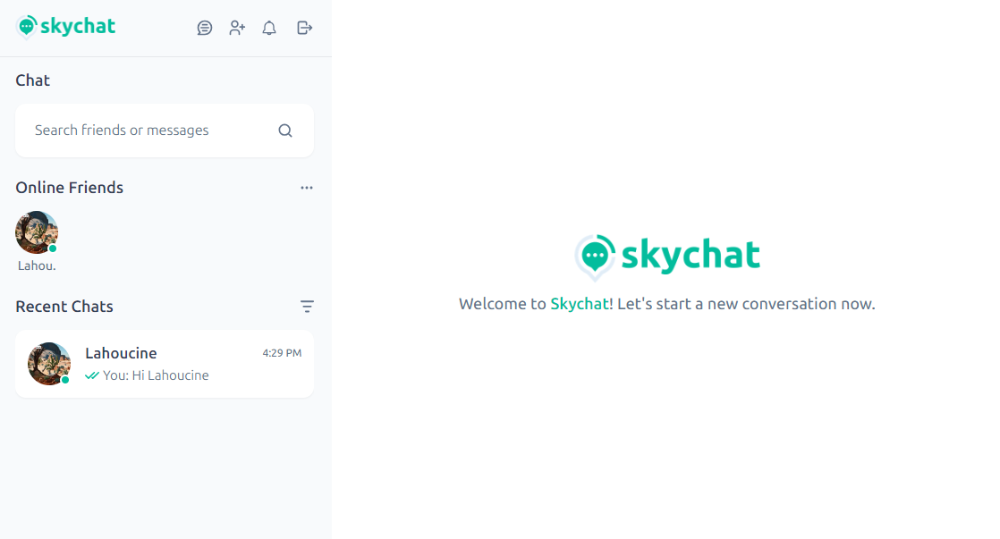
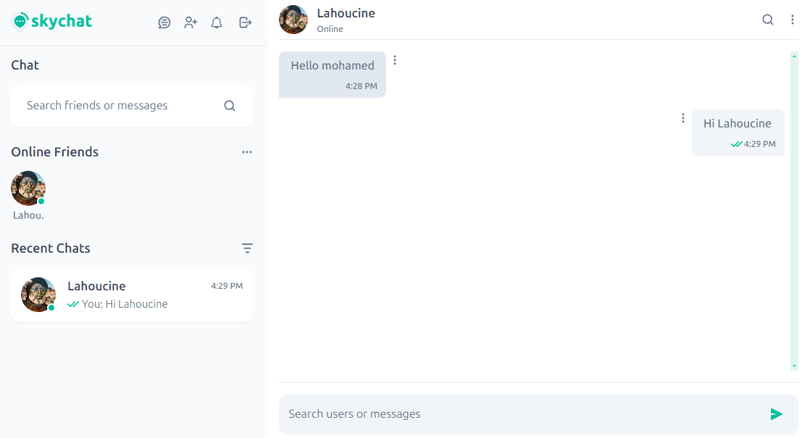
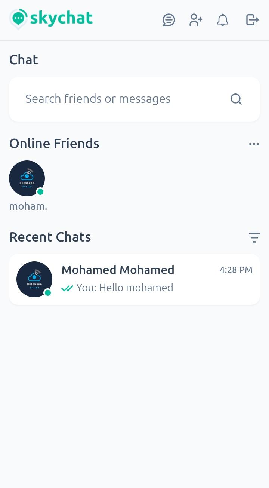
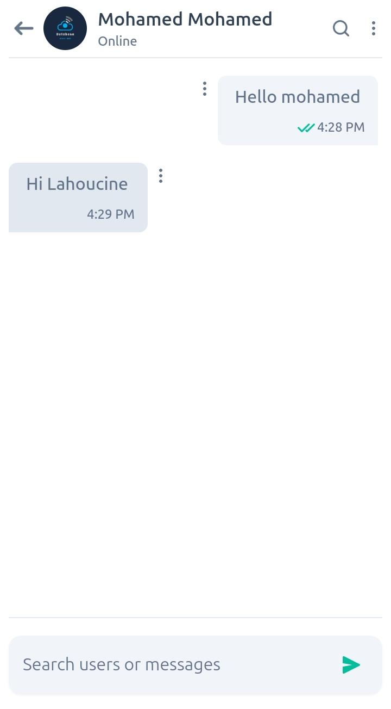

# Realtime Chat Application

This project is a Realtime Chat Web Application built with the MERN stack. It features real-time messaging, invitations, typing status, message status, online state, and search functionalities for friends and recent chats.

This version (v1.0.0) includes text messaging only. Photos, audio recordings, and videos will be included in upcoming releases

## Links

- Code URL: [MERN stack ChatApp code](https://github.com/OumlilLahoucine/mern-stack-chatapp)
- Live Site URL: [MERN stack ChatApp live](https://mern-stack-chatapp-plum.vercel.app)

## Screenshots

### Desktop




### Mobile

<div style='dispay:flex;gap:50'>


</div>

## Features

- Realtime messaging
- Realtime invitations
- Typing state indication
- Message status (sent, delivered, seen)
- Online state and last connection time
- Search for new friends
- Search for recent chats

## Tech Stack

### Frontend

- React
- Vite
- Socket.io-client

### Backend

- Node.js
- Express
- MongoDB
- Mongoose
- Socket.io

## Installation

### Frontend

1. Clone the repository:

   ```sh
   git clone https://github.com/OumlilLahoucine/mern-stack-chatapp
   cd client
   ```

2. Install dependencies:

   ```sh
   npm install
   ```

3. Make sure to set the correct backend API URL in the `.env` file (Create this file first).

   ```env
   REACT_APP_PROXY=YOUR-BACKEND-API-URL
   ```

4. Start the development server:
   ```sh
   npm run dev
   ```

### Backend

1. Clone the repository:

   ```sh
   git clone <repository-url>
   cd server
   ```

2. Install dependencies:

   ```sh
   npm install
   ```

3. Create a `config.env` file and add your MongoDB URI and other environment variables:

   ```env
   NODE_ENV=production
   PORT=3000
   CORS_ORIGIN='YOUR-FRONTEND-URL'
   USERNAME='MONGODB-USERNAME'
   CONNEXION_STRING='MONGODB-CONNEXION-STRING'
   JWT_SECRET='RANDOM-JWT-SECRET(32 characters)'
   JWT_EXPIRES_IN=1d
   ```

4. Start the server:
   ```sh
   npm start
   ```
