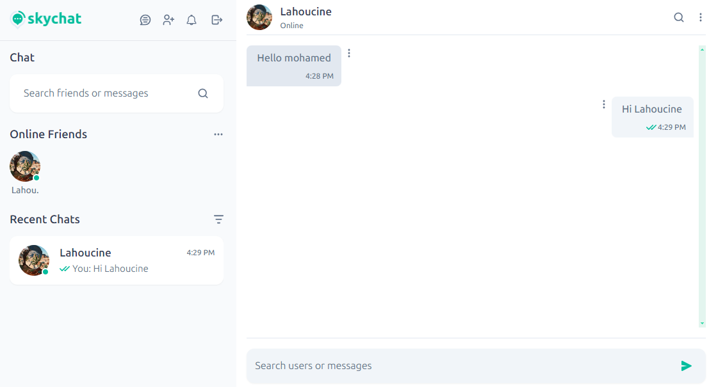
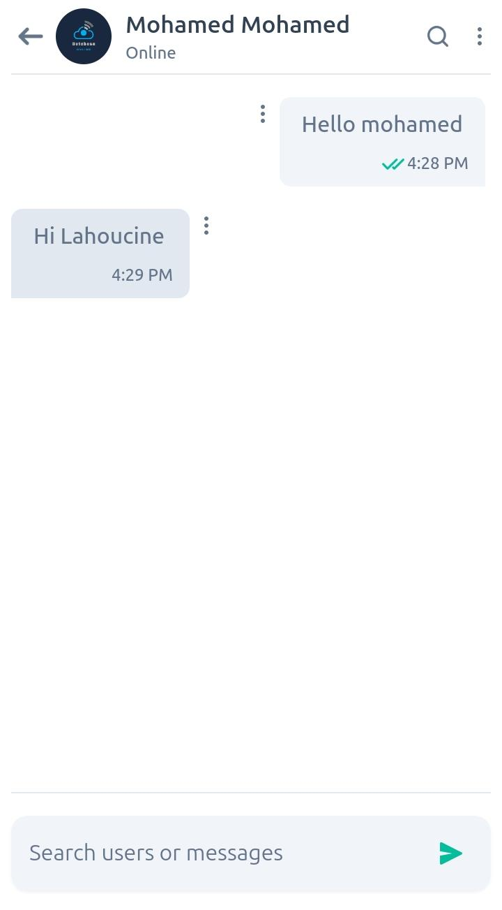

# Realtime Chat Application - Frontend

This project is the frontend of a Realtime Chat Web Application built with React and Vite. It features real-time messaging, invitations, typing status, message status, online state, and search functionalities for friends and recent chats.

This version (v1.0.0) includes text messaging only. Photos, audio recordings, and videos will be included in upcoming releases

## Screenshots

### Desktop




### Mobile

<div style='dispay:flex;gap:50'>


</div>

## Features

- Realtime messaging
- Realtime invitations
- Typing state indication
- Message status (sent, delivered, seen)
- Online state and last connection time
- Search for new friends
- Search for recent chats

## Tech Stack

- React
- Vite
- Socket.io-client

## Installation

1. Clone the repository:

   ```sh
   git clone https://github.com/OumlilLahoucine/mern-stack-chatapp
   cd client
   ```

2. Install dependencies:

   ```sh
   npm install
   ```

3. Start the development server:
   ```sh
   npm run dev
   ```

## Configuration

Make sure to set the correct backend API URL in the `.env` file (Create this file first).

    ```env
    REACT_APP_PROXY=YOUR-BACKEND-API-URL
    ```
